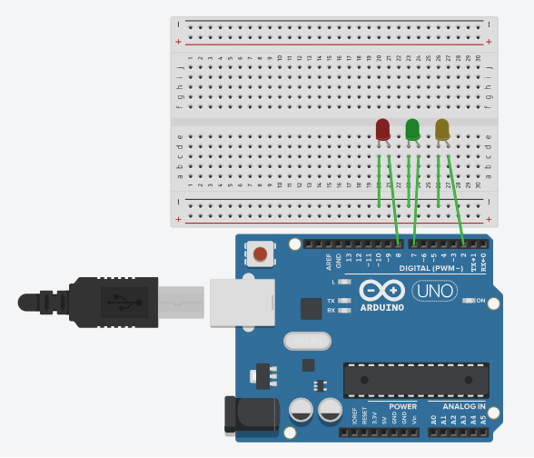
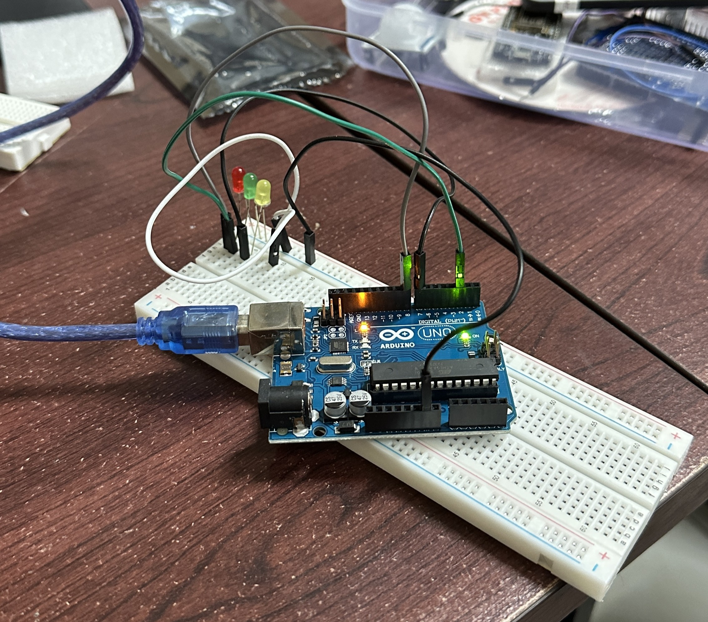

# Jawaban Pertanyaan Perulangan

## 1. Rangkaian Schematic 5 LED Running

Berikut adalah representasi visual dari rangkaian 3 LED berjalan yang digunakan dalam percobaan. Sesuai dengan pelaksanaan praktikum, rangkaian ini dirakit langsung tanpa menggunakan resistor pada masing-masing LED.

<div style="display: flex; gap: 20px; align-items: start; margin-bottom: 20px;">
  <div style="flex: 1; text-align: center;">
    
    <p><em>(Gambar A: Tampilan Schematic Simbol Elektronika)</em></p>
  </div>
  <div style="flex: 1; text-align: center;">
    
    <p><em>(Gambar B: Tampilan Hasil Praktikum)</em></p>
  </div>
</div>

### Tabel Pinout Rangkaian (5 LED)

Tabel berikut menjelaskan koneksi fisik antara komponen LED dan pin pada papan Arduino Uno berdasarkan visualisasi di atas.

| Komponen      | Identifikasi | Pin Arduino Uno | Status / Fungsi           |
| :------------ | :----------- | :-------------- | :------------------------ |
| **LED 1**     | Anoda (+)    | Pin Digital 2   | `OUTPUT` (Sinyal Kontrol) |
| **LED 2**     | Anoda (+)    | Pin Digital 7   | `OUTPUT` (Sinyal Kontrol) |
| **LED 3**     | Anoda (+)    | Pin Digital 8   | `OUTPUT` (Sinyal Kontrol) |
| **Semua LED** | Katoda (-)   | GND (Ground)    | Jalur Negatif             |

---

## 2. Penjelasan Efek LED Berjalan (Kiri ke Kanan)

Efek visual LED menyala bergantian dari arah kiri ke kanan dihasilkan melalui manipulasi variabel di dalam struktur perulangan `for` yang bersifat menaik (_increment_).

**Mekanisme:**
Program menggunakan perulangan `for (int i = 2; i <= 6; i++)`. Perulangan ini dimulai dari nilai pin terendah. Pada setiap tahap iterasi, program menyalakan pin `i`, memberikan jeda waktu, lalu mematikannya kembali. Setelah itu, nilai `i` akan ditambah satu (`i++`), menyebabkan urutan perintah berpindah ke pin digital berikutnya yang berada di posisi sebelah kanan secara berurutan.

---

## 3. Penjelasan Efek LED Kembali (Kanan ke Kiri)

Efek visual LED berjalan mundur dari kanan kembali ke kiri dihasilkan dengan prinsip yang sama, namun menggunakan perulangan `for` yang bersifat menurun (_decrement_).

**Mekanisme:**
Program menggunakan perulangan `for (int i = 6; i >= 2; i--)`. Perulangan diinisialisasi mulai dari nilai pin tertinggi yang digunakan (misalnya 6). Mikrokontroler menyalakan, menahan, dan mematikan pin `i`. Di akhir iterasi, nilai `i` dikurangi satu (`i--`), sehingga instruksi selanjutnya dieksekusi pada pin yang berada di posisi sebelah kiri hingga mencapai batas bawah perulangan.

---

## 4. Program Alternasi 3 LED Kiri dan 3 LED Kanan 

Program di bawah ini mengatur 3 buah LED agar menyala secara bergantian per grup (3 LED sisi kiri dan 3 LED sisi kanan). Namun dalam praktek pada lab kemarin yang dipasang pada breadboard hanya 3 buah LED. Penjelasan detail mengenai fungsi setiap baris kode telah dicantumkan dalam bentuk komentar.

```cpp
/*
  Program Alternasi Grup LED (3 Kiri vs 3 Kanan)
  Deskripsi: Menyalakan Pin 2,3,4 (Grup Kiri) dan mematikan Pin 5,6,7 (Grup Kanan)
             secara bergantian dengan jeda waktu tertentu.
*/

// Mendeklarasikan variabel global untuk mengatur durasi jeda waktu (milidetik)
int timer = 500;

void setup() {
  // Menggunakan perulangan 'for' untuk menkonfigurasi mode pin secara efisien
  // Iterasi berjalan mulai dari Pin Digital 2 hingga Pin Digital 7
  for (int pin = 2; pin <= 7; pin++) {
    // Mengatur setiap pin dalam rentang iterasi (2 s.d 7) sebagai jalur OUTPUT
    pinMode(pin, OUTPUT);
  }
}

void loop() {
  // --- FASE 1: MENYALAKAN GRUP KIRI (PIN 2,3,4), MEMATIKAN GRUP KANAN (PIN 5,6,7) ---

  // Menggunakan perulangan untuk menyalakan 3 LED pada sisi kiri
  for (int i = 2; i <= 4; i++) {
    // Mengirimkan sinyal HIGH (5V) ke pin 'i', menyebabkan LED menyala
    digitalWrite(i, HIGH);
  }

  // Menggunakan perulangan untuk memastikan 3 LED pada sisi kanan dalam keadaan mati
  for (int i = 5; i <= 7; i++) {
    // Mengirimkan sinyal LOW (0V) ke pin 'i', menyebabkan LED mati
    digitalWrite(i, LOW);
  }

  // Menahan status sistem (Grup Kiri ON, Grup Kanan OFF) selama durasi variabel 'timer' (500ms)
  delay(timer);

  // --- FASE 2: MEMATIKAN GRUP KIRI (PIN 2,3,4), MENYALAKAN GRUP KANAN (PIN 5,6,7) ---

  // Menggunakan perulangan untuk mematikan 3 LED pada sisi kiri
  for (int i = 2; i <= 4; i++) {
    // Mengirimkan sinyal LOW (0V) ke pin 'i', menyebabkan LED mati
    digitalWrite(i, LOW);
  }

  // Menggunakan perulangan untuk menyalakan 3 LED pada sisi kanan
  for (int i = 5; i <= 7; i++) {
    // Mengirimkan sinyal HIGH (5V) ke pin 'i', menyebabkan LED menyala
    digitalWrite(i, HIGH);
  }

  // Menahan status sistem (Grup Kiri OFF, Grup Kanan ON) selama 500ms sebelum siklus 'loop' diulang dari awal
  delay(timer);
}
```
