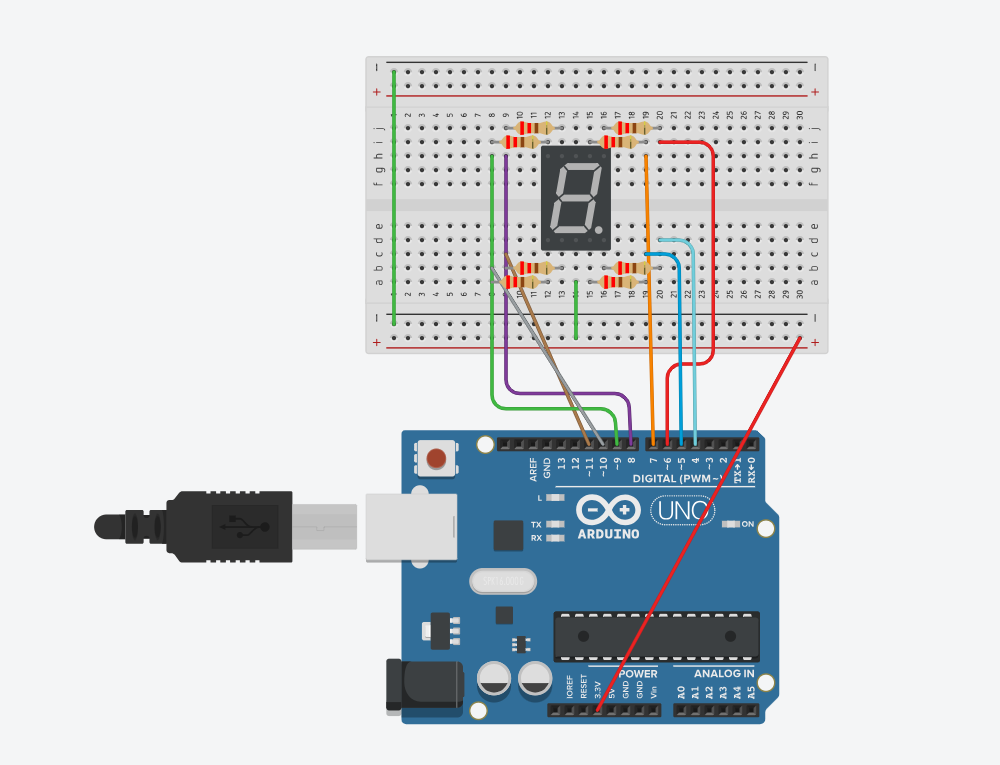

# Jawaban Pertanyaan Praktikum - Modul 2: Pemrograman GPIO

## 1. Skematik Rangkaian Percobaan

<div style="display: flex; gap: 20px; align-items: start; margin-bottom: 20px;">
  <div style="flex: 1; text-align: center;">
    
    <p><em>(Gambar A: Tampilan Schematic)</em></p>
  </div>
  <div style="flex: 1; text-align: center;">
    
    <p><em>(Gambar B: Tampilan Hasil Praktikum)</em></p>
  </div>
</div>

**A. Rangkaian Output (Seven Segment)**
_Seven segment_ dihubungkan ke pin digital Arduino Uno menggunakan resistor 220 Ohm pada masing-masing jalur segmen untuk membatasi arus.
| Pin Seven Segment | Label Segmen | Pin Arduino Uno |
| :--- | :---: | :---: |
| Pin 7 | a | Pin 7 |
| Pin 6 | b | Pin 6 |
| Pin 4 | c | Pin 5 |
| Pin 2 | d | Pin 11 |
| Pin 1 | e | Pin 10 |
| Pin 9 | f | Pin 8 |
| Pin 10 | g | Pin 9 |
| Pin 5 | dp (titik) | Pin 4 |
| Pin 3 / 8 (Common) | GND | GND (Ground) |

---

## 2. Analisis Nilai `num` > 15

Berdasarkan struktur kode pada percobaan ini, fungsi `displayDigit(int num)` menggunakan variabel `num` sebagai indeks baris untuk mengakses _array_ dua dimensi `digitPattern[16][8]`.

Jika nilai `num` lebih dari 15 (misalnya 16, 17, dst.):

1. **Index Out of Bounds / Buffer Overflow:** Program akan mencoba membaca indeks di luar batas maksimal _array_ yang hanya dideklarasikan hingga indeks 15 (berisi 16 elemen dari 0 hingga 15).
2. **Undefined Behavior (Perilaku Tidak Terdefinisi):** Mikrokontroler akan membaca data acak dari blok memori lain yang berada tepat setelah memori _array_ tersebut di dalam RAM.
3. **Efek Visual:** Hal ini akan menyebabkan _seven segment_ menampilkan karakter yang tidak beraturan (nyala/mati LED secara acak/glitch), atau bahkan program dapat mengalami _crash_ jika memori yang diakses bersifat krusial.

Pada program yang benar, batas ini diatasi dengan logika pembatasan: `if(currentDigit > 15) currentDigit = 0;.

---

## 3. Tipe Seven Segment (Common Cathode vs Common Anode)

Program ini menggunakan **Common Cathode** (Katoda Bersama).

**Penjelasan Dasar Logika:**

1. **Komentar Kode:** Terdapat keterangan eksplisit pada baris kode: `// CC: 1 ON, 0=OFF`, yang berarti "Common Cathode: logika 1 untuk menyalakan, 0 untuk mematikan".
2. **Pembuktian Pola Biner:** Pada _array_ `digitPattern`, untuk menampilkan angka '0', pola bitnya adalah `{1,1,1,1,1,1,0,0}`. Angka 1 (HIGH) dikirimkan ke segmen a, b, c, d, e, f agar menyala, sedangkan g dan dp diberi nilai 0 (LOW) agar mati.
3. **Prinsip Fisika Elektronik:** Agar LED menyala dengan sinyal masukan HIGH (5V dari pin Arduino), maka ujung kutub lainnya harus terhubung ke Ground (LOW). Konfigurasi di mana seluruh kutub negatif (katoda) dari 8 LED disatukan dan dihubungkan ke Ground disebut _Common Cathode_.

---

## 4. Modifikasi Program (Tampilan Mundur F ke 0)

Berikut adalah modifikasi program pada Percobaan 2A agar perhitungan berjalan mundur dari F (15) menuju 0 secara berulang, beserta penjelasan baris per baris.

```cpp
#include <Arduino.h>
const int segmentPins[8] = {7, 6, 5, 11, 10, 8, 9, 4};

byte digitPattern[16][8] = {
  {1,1,1,1,1,1,0,0},
  {0,1,1,0,0,0,0,0},
  {1,1,0,1,1,0,1,0},
  {1,1,1,1,0,0,1,0},
  {0,1,1,0,0,1,1,0},
  {1,0,1,1,0,1,1,0},
  {1,0,1,1,1,1,1,0},
  {1,1,1,0,0,0,0,0},
  {1,1,1,1,1,1,1,0},
  {1,1,1,1,0,1,1,0},
  {1,1,1,0,1,1,1,0},
  {0,0,1,1,1,1,1,0},
  {1,0,0,1,1,1,0,0},
  {0,1,1,1,1,0,1,0},
  {1,0,0,1,1,1,1,0},
  {1,0,0,0,1,1,1,0}
};

void displayDigit(int num) {
  for(int i=0; i<8; i++) {
    digitalWrite(segmentPins[i], digitPattern[num][i]);
  }
}

void setup() {
  for(int i=0; i<8; i++) {
    pinMode(segmentPins[i], OUTPUT);
  }
}

void loop() {

  for(int i=15; i>=0; i--) {
    displayDigit(i);
    delay(1000);
  }
}
```
