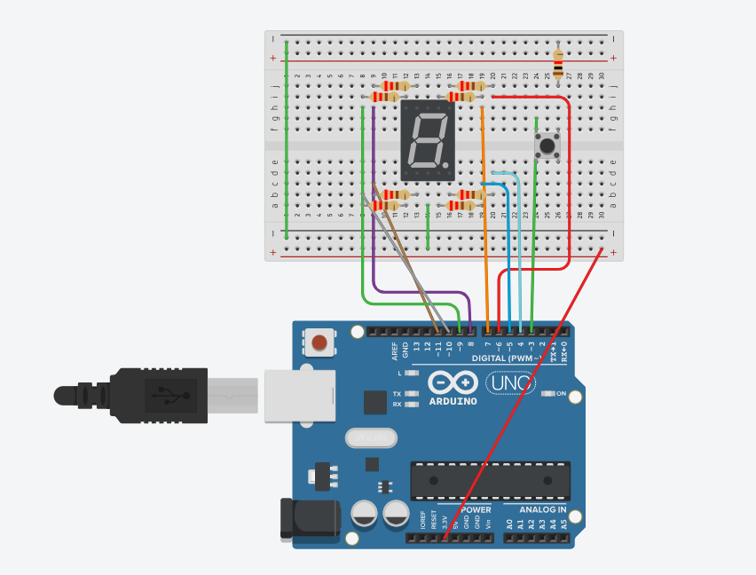
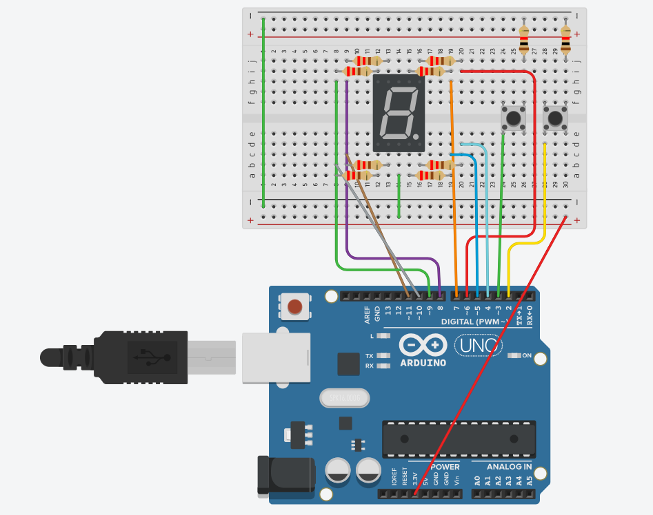

# Jawaban Pertanyaan Praktikum - Modul 2: Pemrograman GPIO

## 1. Skematik Rangkaian Percobaan

<div style="display: flex; gap: 20px; align-items: start; margin-bottom: 20px;">
  <div style="flex: 1; text-align: center;">
    
    <p><em>(Gambar A: Tampilan Schematic)</em></p>
  </div>
  <div style="flex: 1; text-align: center;">
    
    <p><em>(Gambar B: Tampilan Hasil Praktikum)</em></p>
  </div>
</div>

**A. Rangkaian Output (Seven Segment)**
_Seven segment_ dihubungkan ke pin digital mikrokontroler Arduino Uno menggunakan resistor 220 Ohm pada masing-masing jalur segmen untuk membatasi arus.
| Pin Seven Segment | Label Segmen | Pin Arduino Uno |
| :--- | :---: | :---: |
| Pin 7 | a | Pin 7 |
| Pin 6 | b | Pin 6 |
| Pin 4 | c | Pin 5 |
| Pin 2 | d | Pin 11 |
| Pin 1 | e | Pin 10 |
| Pin 9 | f | Pin 8 |
| Pin 10 | g | Pin 9 |
| Pin 5 | dp (titik) | Pin 4 |
| Pin 3 / 8 (Common) | GND | GND (Ground) |

**B. Rangkaian Input (Push Button)**
Untuk sistem dua tombol (Increment dan Decrement):
| Komponen | Fungsi | Koneksi 1 | Koneksi 2 |
| :--- | :--- | :---: | :---: |
| Push Button 1 | Tambah Nilai (Up) | Pin 2 Arduino Uno | GND (Ground) |
| Push Button 2 | Kurang Nilai (Down) | Pin 3 Arduino Uno | GND (Ground) |
_(Catatan: Push button tidak memerlukan resistor eksternal karena menggunakan fitur internal `INPUT_PULLUP` pada Arduino Uno)_.

---

## 2. Analisis Penggunaan Mode `INPUT_PULLUP`

Mode `INPUT_PULLUP` digunakan untuk mengaktifkan resistor _pull-up_ internal di dalam chip mikrokontroler Arduino Uno.

**Keuntungan dibandingkan rangkaian biasa:**

1. **Mencegah Kondisi Floating:** Tanpa resistor _pull-up_, pin input akan berada dalam kondisi "_floating_" (mengambang) saat tombol tidak ditekan, sehingga nilai logikanya tidak stabil akibat gangguan elektromagnetik. Mode ini memastikan pin bernilai HIGH secara _default_.
2. **Efisiensi Komponen:** Menghilangkan kebutuhan penggunaan resistor eksternal di atas _breadboard_, sehingga rangkaian menjadi lebih ringkas.
3. **Penyederhanaan Wiring:** Hanya memerlukan penyambungan kabel langsung dari tombol ke pin Arduino dan ke _Ground_ (GND).

---

## 3. Analisis Penyebab LED Segmen Tidak Menyala

Jika salah satu segmen tidak menyala, kegagalan tersebut dapat disebabkan oleh faktor _hardware_ maupun _software_.

**Penyebab dari sisi Hardware:**

1. **Koneksi Fisik:** Kabel _jumper_ putus atau tidak terpasang dengan kuat (_loose connection_) pada _breadboard_ atau pin Arduino.
2. **Komponen Rusak:** Dioda LED pada segmen tersebut sudah putus, atau resistor pembatas arus (220 Ohm) mengalami kerusakan/terbakar.
3. **Kesalahan Wiring:** Pin segmen tertukar pemasangannya atau pin _common_ tidak terhubung ke GND.

**Penyebab dari sisi Software:**

1. **Kesalahan Pin Mapping:** Nomor pin yang didefinisikan pada _array_ `segmentPins` tidak sesuai dengan jalur kabel fisik yang dipasang.
2. **Kesalahan Logika Bit:** Nilai biner pada _array_ `digitPattern` untuk karakter tersebut dikonfigurasi dengan angka `0` (OFF), padahal seharusnya `1` (ON).
3. **Inisialisasi Gagal:** Pin terkait belum diatur sebagai `OUTPUT` melalui fungsi `pinMode()` di dalam blok `setup()`.

---

## 4. Modifikasi Program (Sistem Counter dengan 2 Push Button)

Berikut adalah modifikasi program untuk mengimplementasikan sistem _counter_ heksadesimal interaktif (0-F) dengan tombol _increment_ dan _decrement_, beserta penjelasan per baris kode.

<div style="flex: 1; text-align: center;">
    
    <p><em>(Gambar A: Tampilan Schematic)</em></p>
  </div>

```cpp
#include <Arduino.h>
const int segmentPins[8] = {7, 6, 5, 11, 10, 8, 9, 4};

const int btnUp = 2;
const int btnDown = 3;

byte digitPattern[16][8] = {
  {1,1,1,1,1,1,0,0},
  {0,1,1,0,0,0,0,0},
  {1,1,0,1,1,0,1,0},
  {1,1,1,1,0,0,1,0},
  {0,1,1,0,0,1,1,0},
  {1,0,1,1,0,1,1,0},
  {1,0,1,1,1,1,1,0},
  {1,1,1,0,0,0,0,0},
  {1,1,1,1,1,1,1,0},
  {1,1,1,1,0,1,1,0},
  {1,1,1,0,1,1,1,0},
  {0,0,1,1,1,1,1,0},
  {1,0,0,1,1,1,0,0},
  {0,1,1,1,1,0,1,0},
  {1,0,0,1,1,1,1,0},
  {1,0,0,0,1,1,1,0}
};

int currentDigit = 0;
bool lastUpState = HIGH;
bool lastDownState = HIGH;

void displayDigit(int num) {
  for(int i=0; i<8; i++) {
    digitalWrite(segmentPins[i], digitPattern[num][i]);
  }
}

void setup() {
  for(int i=0; i<8; i++) {
    pinMode(segmentPins[i], OUTPUT);
  }
  pinMode(btnUp, INPUT_PULLUP);
  pinMode(btnDown, INPUT_PULLUP);

  displayDigit(currentDigit);
}

void loop() {
  bool upState = digitalRead(btnUp);
  bool downState = digitalRead(btnDown);

  if(lastUpState == HIGH && upState == LOW) {
    currentDigit++;
    if(currentDigit > 15) currentDigit = 0;
    displayDigit(currentDigit);
  }

  if(lastDownState == HIGH && downState == LOW) {
    currentDigit--;
    if(currentDigit < 0) currentDigit = 15;
    displayDigit(currentDigit);
  }

  lastUpState = upState;
  lastDownState = downState;

  delay(50);
}
```
